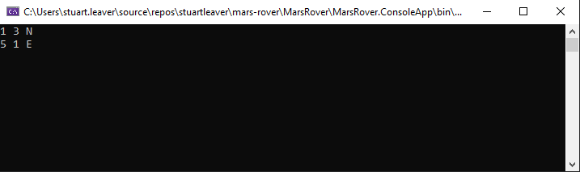

# Problem - Mars Rover
A squad of robotic rovers are to be landed by NASA on a plateau on Mars. This plateau, which is curiously rectangular, must be navigated by the rovers so that their on-board cameras can get a complete view of the surrounding terrain to send back to Earth.

A rover's position and location are represented by a combination of x and y co-ordinates and a letter representing one of the four cardinal compass points. The plateau is divided up into a grid to simplify navigation. An example position might be 0, 0, N, which means the rover is in the bottom left corner and facing North.

In order to control a rover, NASA sends a simple string of letters. The possible letters are 'L', 'R' and 'M'. 'L' and 'R' makes the rover spin 90 degrees left or right respectively, without moving from its current spot. 'M' means move forward one grid point and maintain the same heading.

Assume that the square directly North from (x, y) is (x, y+1).

Write a simple application that takes a user’s starting point, and then directional instructions and displays the resulting position to the user.

## INPUT
The first line of input is the upper-right coordinates of the plateau, the lower-left coordinates are assumed to be 0,0.

The rest of the input is information pertaining to the rovers that have been deployed. Each rover has two lines of input. The first line gives the rover's position, and the second line is a series of instructions telling the rover how to explore the plateau.

The position is made up of two integers and a letter separated by spaces, corresponding to the x and y co-ordinates and the rover's orientation.

Each rover will be finished sequentially, which means that the second rover won't start to move until the first one has finished moving.

## OUTPUT
The output for each rover should be its final co-ordinates and heading.

## INPUT AND OUTPUT
### Test Input:
5 5

1 2 N

LMLMLMLMM

3 3 E

MMRMMRMRRM

### Expected Output:
1 3 N

5 1 E

## OUTPUT
The following screenshot is the output from running the actual code:

## Notes
* There was no specific requirements on graphical output. Therefore, only the final locations have been included.
* It could be argued that the `switch` statements go against the Open/Closed SOLID principle. While it is important to develop with the SOLID principles in mind, other facts need to be taken into account. For example, how often are new directions going to be introduced? In this case, would meeting the Open/Closed principle make the code harder to read for no good reason?
* No Dependency Injection container has been setup because DI is done manually. Should the code be used in a different way, then setting up a container would be an option.
* Unit Testing
  * The code in `MarsRover.ConsoleApp` is not covered. This is because it is essentially just a way of graphically showing the resulting output of the code in `MarsRover.Core`. Similar to the engine ignition (or Start/Stop button) and the actual engine.
  * The `ArgumentOutOfRangeException` default switch labels are not covered because in theory, they can't be reached due to the use of enum's and the testing for invalid values earlier in the code.
  * The equality methods have been overridden for the `Rover` class to aid in some unit test assertions. Unit test coverage has not been added as it is tested in a fashion by the unit tests that use it.
